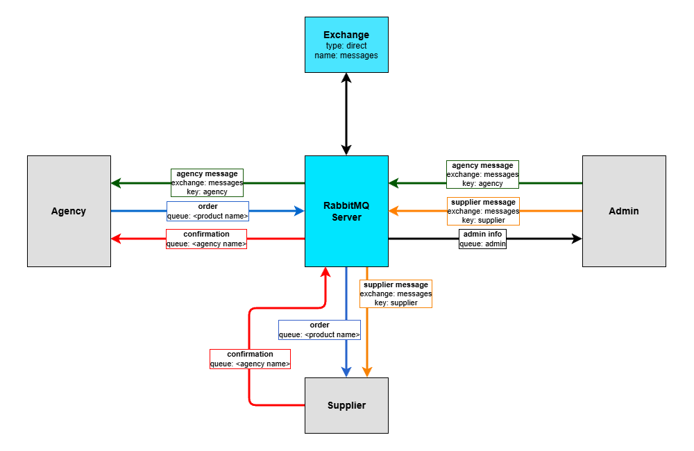

# Distributed systems
## Project content
**Lab 1** - Sockets 
**Lab 2** - REST API 
**Lab 3** - Middleware: gRPC 
**Lab 4** - Middleware: ICE 
**Lab 5** - RabbitMQ 
**Lab 6** - Ray

## RabbitMQ system architecture

